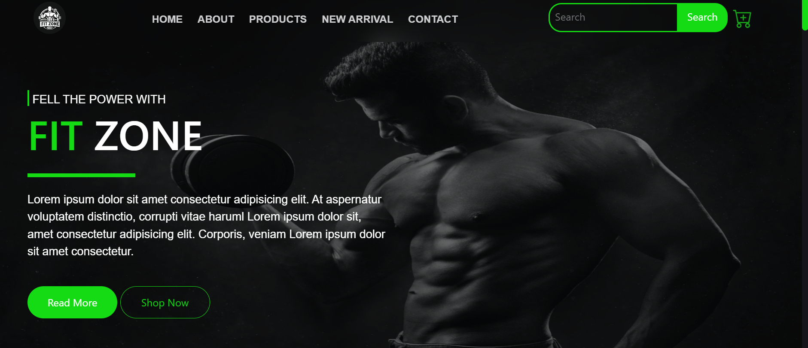
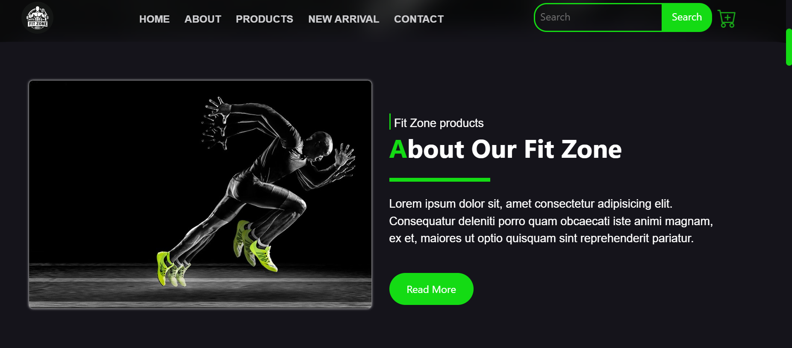
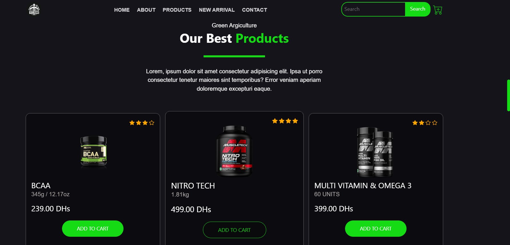
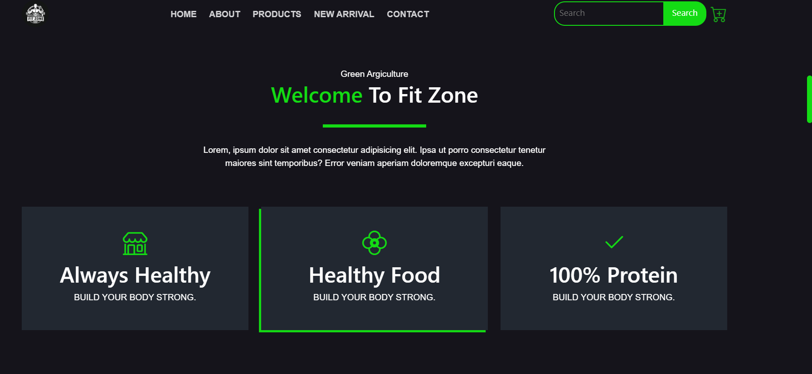

# FitZone - E-Commerce Website for Fitness Products

Welcome to the **FitZone** GitHub repository! This project is an e-commerce website dedicated to providing premium fitness products to health enthusiasts. Built with HTML, CSS, and Bootstrap, the website offers a sleek and user-friendly interface, ensuring a seamless shopping experience.
<div align="center"> 
    
    
    
    
</div>

## Table of Contents
- [Demo](#demo)
- [Features](#features)
- [Technologies Used](#technologies-used)
- [Setup](#setup)
- [Usage](#usage)
- [Contributing](#contributing)
- [License](#license)

## Demo
Check out the live demo of the FitZone website [here](https://fitzone01.000webhostapp.com/).

## Features
- **Responsive Design:** Ensures compatibility across various devices and screen sizes.
- **Dynamic Hero Section:** Eye-catching visuals and clear call-to-action buttons.
- **Product Showcase:** Display of top-selling products with images, descriptions, and prices.
- **User-Friendly Navigation:** Easy access to all sections including Home, About, Products, New Arrival, and Contact.
- **Search and Cart Functionality:** Simplifies the shopping process with a search bar and shopping cart icon.

## Technologies Used
- **HTML5**
- **CSS3**
- **Bootstrap 5**

## Setup
To run this project locally, follow these steps:

1. **Clone the repository:**
   ```bash
   https://github.com/AkramBl1/FitZone.git

2. **Navigate to the project directory:**
cd fitzone

3. **Open index.html in your browser to view the website.**

## Usage
Explore the website to:
- View detailed information about FitZone and its mission.
- Browse a variety of fitness products.

## Contributing
welcome contributions to enhance the FitZone website! Please feel free to fork the repository and submit pull requests for bug fixes, improvements, or new features.

## License
This project is licensed under the MIT [License](LICENSE) - see the LICENSE file for details.
